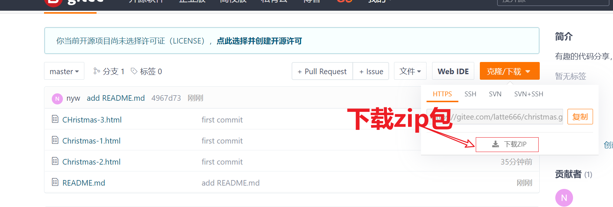

# 使用说明

## 第一步

将代码下载



## Chrimstmas-1.html 使用

- 搜索 Latte ,对该部分进行修改

- 第一处文字修改: 修改为你想要的文字

  ```html
      let myLabels = [
          " Latte ",
          "Merry Christmas",
          "健健康康，平安喜乐",
          "一定要站在你所热爱的世界里闪闪发光",
      ];
  ```

  

- 第二处音乐修改: 搜索 music, 替换为你想要的音乐

  ```html
   let init_flag = false;
      // music
      let music_url = "http://music.163.com/song/media/outer/url?id=1407919322.mp3";
      let _music = new Audio(music_url);
  ```

  

## Chrimstmas-2.html 使用

- 搜索 Latte ,对该部分进行修改

- 第一处文字修改: 修改为你想要的文字

  ```html
    <div id="overlay">
        <ul>
          <li class="title">To Latte：</li>
          <li>
            <button class="btn" id="btnA" type="button">
              <!-- Merry Christmas  -->
              🎁
            </button>
          </li>
        </ul>
      </div>
  ```

  第二处修改：

```html
 <script id="rendered-js">
      // 💗 ‼️ ‼️ 想要说的话在这里 💗
      const my_labels = [
        "Latte",
        "Merry Christmas",
        "一定要成为更好的人鸭",
        "健健康康，平安喜乐",
      ];
```

第三处修改：修改音乐

将 http://music.163.com/song/media/outer/url?id=1892513656.mp3 链接粘贴到浏览器地址栏，然后把浏览器中转换后的地址粘贴到代码中

```html
const files = [
                // 1407919322 1892513656 1892513656
          //"http://music.163.com/song/media/outer/url?id=1892513656.mp3", // ! 音乐资源获取
            "http://m701.music.126.net/20221217150953/e4c4f12bd5885c5a55f6fe73a3ef214b/jdymusic/obj/wo3DlMOGwrbDjj7DisKw/19883935120/f53b/2f75/f72e/c45a8ea06503fc1cc3108e9c473a6021.mp3"
          
        ];
```

## Chrimstmas-3.html 使用

直接双击就能使用